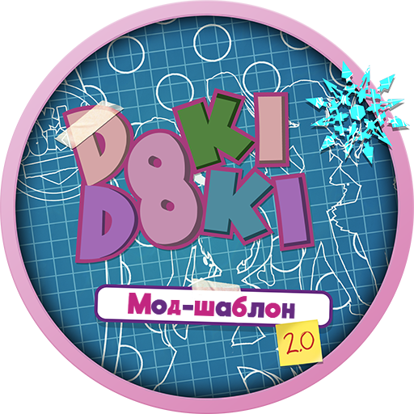
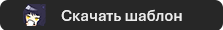

# Welcome to the **New** Python 3 Modification Club!

[!WARNING]
> This branch of the Python 3 DDLC Mod Template is a work in progress. Use at your own risk!

  

  

   
   

The **new** Python 3 DDLC Mod Template is a mod template made by Azariel Del Carmen (bronya_rand) for the **original** Doki Doki Literature Club that adheres to [Team Salvato's IP Guidelines](http://teamsalvato.com/ip-guidelines/) for fan mods on Ren'Py 8.

> [!NOTE] 
> For Ren'Py 6-7 support, see the [Python 2](https://github.com/Bronya-Rand/DDLCModTemplate2.0/tree/python-2) branch of the mod template.

### Disclaimers

- <u>Team Salvato</u>
  > The template code/files are designed for original DDLC fan games and mods that use DDLC assets with Ren'Py. It is not meant for non-DDLC projects. The DDLC Mod Template is not afilliated in anyway with Team Salvato.
- <u>bronya_rand</u>
  > You may not use the template to make unofficial DDLC patchers, fixes, etc.

### **Credit Requirements**

You must include a name credit in your mods' credits screen and/or `credits.txt` file. Below is a example credit you may use.

> This mod was made possible by bronya_rand's DDLC Mod Template 2.0: https://github.com/Bronya-Rand/DDLCModTemplate2.0

By default a credits screen is enabled in-game, either in the Extras screen or as a button in-game if the Extras screen is disabled.

Optional but very appreciated credits that you can also add are:

1.  A custom splash screen that features the Team Salvato logo (and/or your mod logo) and a `Bronya Rand` logo (which can be found [here](.github/IMAGES/Logos/)).
2.  A small mention in the game's disclaimer saying that this mod was not possible without using bronya_rand's mod template.
3.  A presplash screen that contains a `Bronya Rand` logo (which can be found [here](.github/IMAGES/Logos)).
4.  Present a custom idea to me for approval either through Discord or Reddit.

### Template Features

1. Ren'Py 8 Team Salvato Compliant Mods and Splashscreen (Disclaimer)!
2. Optimized, cleaned Python code for Python 3 and Ren'Py 8!
3. Original DDLC game scripts for reference purposes!
4. Support for macOS, Linux and Android! (\*)

> [!NOTE] Regarding Mod Support for Linux and Android:
Linux users must run your mod via `LinuxLauncher.sh`. For Android, if your mod uses more complex code or non-mobile friendly features, it may require some adjustments and changes to get working. See _Android Mod Guide.pdf_ or visit the DDMC Discord for additional help.

5. Xcode Support! Open this project in Xcode and you can edit, build, and run your mod without opening the Ren'Py Launcher ever again!
   > Note: You need to change your `RENPY_TOOL` location and the Ren'Py app location in the target scheme for Xcode. [Learn more &rsaquo;](XCODE.md)
6. Uncensored Mode and Let's Play Mode! - Allow more "sensitive" content to be shown in-game and protect your IRL information while streaming/recording!
7. Automatic GUI Coloring and Different Menu Button Colors! - Color the GUI and/or menu buttons in the game to whatever you like without editing the asset files themselves!
8. Terra's in-depth Poem Game guide!
9. NVL Support thanks to Yagamirai01!
10. Patches for several Ren'Py releases and Windows features.
11. Python 3 support and code now in use!
12. Dynamic Super Resolution/Dynamic Super Positions (DSR/DSP) and Custom Resolutions! - Scale positions and/or your assets higher than they usually can go and display DDLC in different resolution modes. The DDLC Mod Template is now a universal X resolution template!
13. Player Name Change! - Did you wrongly typed your name or want to change it? You can now do so very easily!
14. New Monika Console and Poem Responses! - Enjoy a easier console to type commands in and a cleaner, easier poem response!

In addition to these base features, the template comes with additional optional features you can use such as

- **[BETA]** Pronoun Support! - Allow players to identify with the pronoun they go by!
  > See _mod_extras/pronouns.rpy_ in the `game` folder for a example on how to use this feature.
- Better Blue Screens of Death! - Make your own BSOD easily in-game on every OS!
- Gallery and Achievements Menu! - Allow players to see the work you have done in-game and earn achievements for playing your mod!
- **[BETA]** Discord Rich Presence!

> To download these features, you must download the `DDLCModTemplate-X.X.X-Extras.zip` along with the base game.

### Returned Features

1. Ghost Menu (Dan's spooky easter egg).
2. Sayori Kill Script (plays if Sayori is deleted before the game starts).
3. Monika Kill Script (plays if Monika is deleted before a new game starts).
4. Special Poems (The random poems in DDLC that appear in Act 2) <u>[now improved!]</u>.

### Getting Started
1. Download the latest version of Ren'Py from [Ren'Py.org](https://www.renpy.org/latest.html).
2. Download the PC version of DDLC from [DDLC.moe](https://ddlc.moe/).
3. Download the latest version of the DDLC Mod Template from the [Releases](https://github.com/Bronya-Rand/DDLCModTemplate2.0/releases).
4. Run/Extract Ren'Py to a folder of your choice.
> [!WARNING]
> Do not extract Ren'Py to a cloud storage folder (e.g. Google Drive, OneDrive, etc.) as it will cause issues when testing your mod in the Ren'Py Launcher.
5. Create a new folder in the `renpy-8.X.X-sdk` folder and extract the DDLC Mod Template ZIP file into that folder.
6. Open `DDLC-1.1.1-pc.zip` and extract the following RPA files into the `game` folder of the DDLC Mod Template:
   - `audio.rpa`
   - `fonts.rpa`
   - `images.rpa`
7. Open the Ren'Py Launcher and select the DDLC Mod Template project.
8. Click on _Launch Project_ to start the mod template.

### Building
Once you finished making your mod, go back to the Ren'Py Launcher and click on _Build Distributions_. Uncheck all the options and check only **Ren'Py 8 DDLC Compliant Mod**, then click <u>Build</u>. This will create a cross-platform mod package ZIP file with your mod files.

> [!NOTE]
> Ren'Py 8 Mods are classified with the `-Renpy8-DDLCMod` ending in the ZIP filename.

### Getting Started For Android Porting/Modding

Refer to [_The DDLC Android Mod Guide_](./Documentation/Android%20Mod%20Guide.pdf) for more in-depth information about making your mod work on Android.

> For older templates, refer to the PDF in your templates' ZIP file as the latest guide may not match your current template.

### Credits
Thanks to the following people for their contributions to the DDLC Mod Template:
> [!INFO]
> This list goes from the past to present.

- Dan Salvato (DDLC)
- renpytom (Ren'Py)
- MAS Team (template base before revamping)
- alicerunsonfedora (Xcode)
- Terra (In-depth poem game)
- Yagamirai01 (NVL)
- Alexxonder (Auto Color Adjustments)
- Elckarow (Python 3 updates, New poem responses/effects)
- NekoLaiS (Cryllic compatibility)
- The DDMC Community (Feature suggestions and feedback)
- Pseurae (Donation/Act 3 GL2 Fix)
- Lezalith (New Console (4.1.1+))
- RS/6000 (New Mod Template Logo (4.2.1+))
- Tulkas (Android Gestures)
- FiT (Weiss Chibi Branding Icon Design)

Copyright © 2019-2025 Azariel "Bronya Rand" Del Carmen (bronya_rand). All rights reserved.

Doki Doki Literature Club, the Doki Doki Literature Club code, is the property of Team Salvato (Dan Salvato LLC). Copyright © 2017 Team Salvato. All rights reserved.
