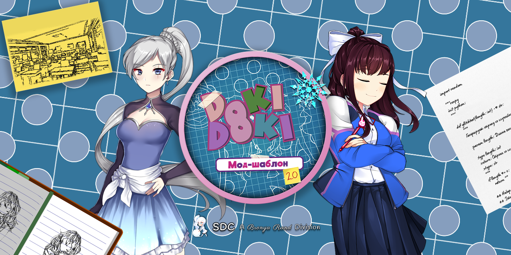

# Добро пожаловать в **новый** клуб модификаций!

<p align="center">
  
</p>

<p align="center">
   <a href="https://github.com/Inui-senpai/DDLCModTemplate2.0/releases/latest">
      
   </a>
   &nbsp;&nbsp;
   <a href="https://ko-fi.com/K3K22K8SU">
      
   </a>
</p>

## Содержание
- [📖 Общие сведения](#-общие-сведения) 
- [📋 Требования к указанию авторства (важно)](#-требования-к-указанию-авторства) 
- [✨ Особенности](#-особенности) 
- [🚀 Как готовить](#-как-готовить) 
- [📦 Сборка и публикация](#-сборка-и-публикация)
- [🎯 Нюансы некоторых платформ](#-нюансы-некоторых-платформ)
- [📚 Дополнительные ресурсы](#-дополнительные-ресурсы)
- [👏 Авторы](#-авторы)

## 📖 Общие сведения

Мод-шаблон DDLC версии 2.0 – это всеобъемлющий мод-шаблон для игры **«Литературный клуб "Тук-тук!"»**, который полностью соответствует [Рекомендациям по использованию интеллектуальной собственности Team Salvato](http://teamsalvato.com/ip-guidelines/). 

Собранный для Ren'Py 8.X.X Азариелем Дель Карменом (bronya_rand), этот шаблон имеет всё, что вам нужно для создания фанатских, кроссплатформенных модификаций, включающих в себя современные функции и оптимизированный код.

**Шаблон прекрасно подойдёт:**
- Новичкам, которые ищут надёжную основу.
- Продвинутым моддерам, которые хотят перейти на Ren'Py 8.
- Разработчикам, которые ищут кроссплатформенную совместимость (Windows x64, macOS, Linux, Android).

> [!NOTE]
> **Мод-шаблон DDLC не имеет никакого отношения к Team Salvato и не предназначен для использования с сиквелом «Литературный клуб "Тук-тук!" Плюс». Не используйте этот шаблон и его составляющие для неофициальных патчей, фиксов и т.д. для оригинальной игры.**

---

## ✨ Особенности

### Основные особенности

- ✅ **Соответствует требованиям Team Salvato** – включает в себя обязательный вступительный экран (дисклеймер) и соответствует всем Рекомендациям для фанатских модификаций.
- 🐍 **Оптимизирован под Python 3 и Ren'Py 8** – чистый, современный код, оптимизированный под последние версии Ren'Py.
- 📚 **Имеет скрипты оригинальной игры** – изучайте и используйте механики оригинальной игры в своих целях.
- 🌐 **Поддержка нескольких платформ** – собирайте под Windows, macOS, Linux и Android.
- 🎨 **Автоматическое перекрашивание интерфейса** – изменяйте цвета интерфейса и кнопок меню, не редактируя сами текстуры.
- 🖼️ **Динамическое разрешение (DSR/DSP)** – мод-шаблон поддерживает «неродные» разрешения экрана.
- 📝 **Изменение имени игрока** – даёт игрокам возможность исправить неверное написание имени или изменить его прямо в игре.
- 💬 **Улучшенные консоль и реакции на стихи** – улучшенная консоль Моники и более читабельная система реакций на стихи.

### Геймплейные особенности

- 🎮 **Режим «Без цензуры»** – можно включить/выключить отображение чувствительного контента.
- 📹 **Режим летсплеера** – защитите личную информацию во время стрима/записи.
- 📖 **Поддержка NVL** – полная поддержка диалогов во весь экран (NVL), спасибо Yagamirai01.

### Восстановленный функционал DDLC

Особенности оригинальной игры были восстановлены и улучшены:
- 👻 **«Призрачное» меню** – пугающая пасхалка Дэна.
- 💔 **Скрипты убийства персонажей** – скрипты удаления Сайори и Моники.
- 📄 **Особые стихотворения** – случайные стихи, показываемые во втором акте _(стали ещё лучше!)_.

### Необязательный доп. функционал

> [!IMPORTANT]
> Скачайте архив `DDLCModTemplate-X.X.X-Extras.zip`, чтобы получить нижеописанные «плюшки».

- 💥 **Улучшенные BSoD** – создавайте свои Синие экраны смерти на всех платформах.
- 🖼️ **Система галереи** – демонстрируйте свои арты и сценки.
- 🏆 **Меню достижений** – награждайте игроков за прохождение рубежей.
- 🎮 **[БЕТА] Интеграция с Discord** – отображайте прогресс прохождения модификации в Discord.

---

## 🚀 Как готовить

### Что нужно скачать
1. **[Ren'Py 8.X](https://www.renpy.org/latest.html)** 
2. **[DDLC (ПК-версия)](https://ddlc.moe/)**
3. **[Этот мод-шаблон](https://github.com/Inui-senpai/DDLCModTemplate2.0/releases/latest)**

### Процесс установки

1. **Распакуйте Ren'Py SDK** в любую удобную папку.
> [!WARNING]
> Ни в коем случае не распаковывайте SDK в папку облака (Google Drive, OneDrive и т.п.), иначе во время тестирования модификации возникнут нерешаемые проблемы.

2. **Создайте новую папку** внутри папки `renpy-8.X.X-sdk` и распакуйте туда скачанный мод-шаблон.

3. **Распакуйте ресурсы оригинальной игры** – откройте архив `DDLC-1.1.1-pc.zip` и скопируйте в папку `game` мод-шаблона следующие RPA-файлы:
   - `audio.rpa`
   - `images.rpa`

4. **Запустите шаблон**
   - Откройте лаунчер Ren'Py и выберите Русский язык.
   - Затем выделите проект «Мод-шаблон DDLC».
   - Нажмите на кнопку _Запустить проект_, чтобы проверить работу.

🎉 Вы готовы создавать модификации!

---

## 📦 Сборка и публикация

Когда ваша модификация будет готова к публикации:

1. Откройте **лаунчер Ren'Py**.
2. Выберите **Построить дистрибутивы**.
3. **Уберите все галочки** в сноске `Построить пакеты` и поставьте галочку на пункте **DDLC-совместимый мод на Ren'Py 8**.
4. Нажмите на кнопку **Построить**.

После этого будет создан ZIP-архив с файлами кроссплатформенной модификации (имеющий `-Renpy8-DDLCMod` в конце имени), готовый к публикации.

> [!TIP]
> Всегда тщательно тестируйте свою модификацию перед сборкой и публикацией!

---

## 🎯 Нюансы некоторых платформ

### Android

Для обеспечения работоспособности вашей модификации на Android необходимо учесть дополнительные факторы, особенно при наличии сложных функций или кода, не адаптированного под мобильные устройства.

📱 **Прочитайте это полное руководство:** [Сборка модификации под Android](./Documentation/Android%20Mod%20Guide.pdf)

### Linux

Пользователи ОС Linux должны запускать модификации через специальный скрипт (хотя бы один раз):

```bash
./LinuxLauncher.sh
```

### macOS

Мод-шаблон поддерживает macOS «из коробки». Во время сборки дистрибутивов будет также создан пакет для macOS.

---

## 📋 Требования к указанию авторства

> [!IMPORTANT]
> **Вы ОБЯЗАНЫ указать факт использования этого шаблона в своей модификации.** В самой игре уже включён экран Авторов (либо в разделе Доп. контент, либо как отдельная кнопка). Вы можете использовать стандартную реализацию, либо выбрать любую из нижеприведённых альтернатив.

### Стандартное указание авторства

Добавьте этот текст в свои титры и/или файл `credits.txt`:

```
Эта модификация появилась на свет благодаря мод-шаблону версии 2.0 от bronya_rand и Inui-senpai: https://github.com/Inui-senpai/DDLCModTemplate2.0
```

### Альтернативные варианты указания авторства

Если вы предпочитаете иной подход, вы можете использовать один из следующих вариантов:

1. **Собственный вступительный экран** – изображение, на котором также имеются логотипы Team Salvato и Брони Рэнд ([последнее можно взять тут](.github/IMAGES/Logos/)).
2. **Упоминание в дисклеймере** – добавьте этот текст в дисклеймер: "Эта модификация появилась на свет благодаря мод-шаблону от bronya_rand и Inui-senpai".
3. **Экран предзагрузки** – добавьте на свой экран предзагрузки логотип Брони Рэнд ([можно взять тут](.github/IMAGES/Logos)).
4. **Своя реализация** – отправьте мне в Discord или Reddit свою реализацию указания авторства на одобрение.

---

## 📚 Дополнительные ресурсы

### Документация

- 📱 [Сборка модификации под Android](./Documentation/Android%20Mod%20Guide.pdf) – полное руководство по портированию на Android
- 🎮 [Руководство по настройке интеграции с Discord](./Documentation/Discord%20RPC%20Guide.pdf) – всё о настройке интеграции с Discord
- 📝 [Руководство по новой мини-игре про сочинение стихов](./Documentation/New%20Poemgame%20Guide.pdf) – подробная документация о мини-игре про сочинение стихов

### Сообщество и поддержка

- 💬 **Сервер DDMC в Discord** – обращайтесь за помощью и делитесь своими модификациями с сообществом
- 🐛 **Проблемы** – сообщайте о багах в [разделе Проблем](https://github.com/Bronya-Rand/DDLCModTemplate2.0/issues) на оригинальном репозитории
- ☕ **Поддержать разработку** – [скиньтесь автору на чашечку кофе](https://ko-fi.com/K3K22K8SU)

---

## 👏 Авторы

Выражаю свою благодарность этим людям за их вклад в развитие мод-шаблона DDLC:

> [!NOTE]
> Этот список охватывает период с прошлого по настоящее.

- Дэн Салвато (DDLC)
- renpytom (Ren'Py)
- Команда MAS (основа шаблона до переписывания)
- alicerunsonfedora (Xcode)
- Terra (подробный разбор мини-игры про сочинение стихов)
- Yagamirai01 (NVL)
- Alexxonder (автоматическое изменение цвета)
- Elckarow (миграция на Python 3, новые реакции на стихи/эффекты)
- Сообщество DDMC (предложение функций и отзывы)
- Pseurae (пожертвование/исправление спецэффектов в третьем акте на рендерере GL2)
- Lezalith (новая консоль (4.1.1+))
- RS/6000 (новый логотип мод-шаблона (4.2.1+))
- Tulkas (жесты на Android)
- FiT (дизайн значка брендинга в стиле чиби-версии Вайсс)
- Retronika (вспомогательный код для системы галереи)
- Контрибьюторы Ren'Py (базовый перевод интерфейса на русский)
- Энтузиасты Team (перевод оригинальной игры)
- Amanda Watson (перевод текстовой и скриптовой составляющих мод-шаблона)
- Inui-senpai (перевод графической составляющей мод-шаблона)

---

<p align="center">
   <b>Авторские права © 2019-2025 Азариель «Bronya Rand» Дель Кармен (bronya_rand). Все права защищены. Игра «Литературный клуб "Тук-тук!"» и её составляющие являются собственностью Team Salvato. Авторские права © 2017 Team Salvato. Все права защищены.</b>
</p>
